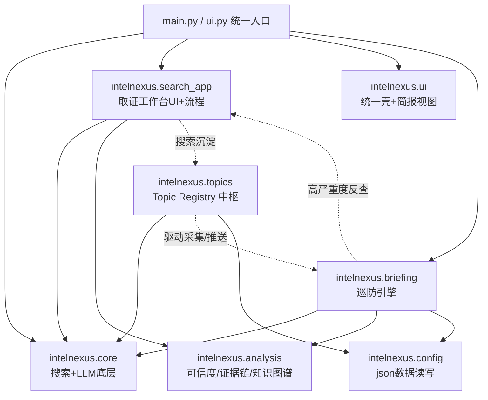

## 产品概述

将 IntelNexus 从「情报搜索 + 简报中心两块物理拼装」重构为「单一情报操作系统」：搜索（单点取证工作台）与简报（自动巡防引擎）共享一个 Topic（情报主题）中枢，形成双向闭环，并补上增量感知与个性化订阅，真正击中情报分析人员的核心痛点。

## 核心特性

- 目录归一：消除 sys.path hack，将 shared/、src/、intel-search/src/、intel-briefing/ 统一为新单包 intelnexus/，新人一秒看懂结构。
- Topic Registry 中枢：系统预设 6 类关注点 + 用户搜索行为沉淀的常驻 Topic，成为采集与推送的统一数据源。
- 双向飞轮：搜索结果可固化为常驻 Topic 塑造简报；简报高严重度条目可一键反查生成取证任务。
- 增量感知（Delta）：简报对比历史存档，输出相比昨日的新增/升级/消失条目，解决信息过载。
- 个性化订阅：订阅者按 interests 过滤类目，只收自己关心的方向，告别大杂烩。
- 知识图谱复用：简报复用 IntelligenceGraph 生成本期实体关系缩略图，与搜索共享分析深度。

## 技术栈

- 语言：Python 3.10+（保持现有）
- CLI：Click（现有 main.py 已用）
- Web UI：Streamlit（现有 ui.py 已用）
- LLM：langchain-core + Ollama/云端（现有 shared/llm）
- 数据持久化：JSON 文件（复用现有 safe_read_json/safe_write_json）
- 无新增重依赖，重构期零逻辑改动

## 实现方案

采用「单包重构 + 中枢融合」策略：先把分散在 shared/、src/、intel-search/src/、intel-briefing/ 的业务真身搬入唯一包 intelnexus/（消除路径 hack，纯机械搬家），再在其上叠加 topics/ 中枢与融合功能。核心决策：

1. 先归一后融合——阶段1 只搬不删逻辑，确保每步可验证、可回滚，避免一次性大改 import 导致不可调试。
2. 保留既有 thin wrapper 真身（darkweb 实现从 intel-search/src/search 搬入，删 wrapper 链）。
3. Topic 作为采集/推送的统一数据源，取代写死的 WATCH_CATEGORIES，实现用户行为驱动简报。
4. Delta 复用已有 briefing_history 存档，零新增存储成本。

性能与可靠性：搬家不改变运行时行为；Topic 遍历为 O(n) 类目采集（与原 WATCH_CATEGORIES 同量级）；Delta diff 基于已有存档线性比对，无额外抓取。

## 实现注意事项

- 阶段1 搬完后必须 `grep "from src\|from ai_briefing\|from shared"` 全量校验无残留旧前缀，再删除旧目录。
- darkweb.py 原 src/search/darkweb.py 是 re-export wrapper，需搬 intel-search/src/search/darkweb.py 真身并改 import。
- briefing_export.py 原在 intel-briefing/src/export 被动态 import_module 加载，搬入 intelnexus/briefing/export 后改为静态 import。
- 保留 ui.py 的 `_render_bulk_collect_button` 与 collector.consume_drafts 飞轮逻辑，阶段2 升级为 Topic。
- 不改动 data/ 下 json 实际路径与字段，仅调整读写模块归属。

## 架构设计

重构后模块关系（消除路径 hack，统一 intelnexus 包）：



## 目录结构

```
IntelNexus/
├── main.py                 # [MODIFY] 入口，改 import 前缀为 intelnexus.，删 sys.path hack
├── ui.py                   # [MODIFY] Streamlit 入口，改 import，合并 search/briefing Tab
├── config.py               # [KEEP] 全局配置不变
├── data/                   # [KEEP] json 数据不变
├── intelnexus/             # [NEW] 统一单包
│   ├── __init__.py
│   ├── core/               # [NEW] = 原 shared/（search/llm/settings/logger/ui）
│   ├── analysis/           # [NEW] = 原 src/analysis（credibility/evidence_tracer/intelligence_graph）
│   ├── search_app/         # [NEW] = 原 src/ui(search) + intel-search/src/search/darkweb 真身
│   │   └── darkweb.py      # [NEW] 从 intel-search/src/search/darkweb.py 搬真身实现
│   ├── briefing/           # [NEW] = 原 intel-briefing/ai_briefing（collector/analyzer/notifier/scheduler/templates/prompts/pipeline/config）+ export/
│   ├── topics/             # [NEW] Topic Registry 中枢
│   │   ├── registry.py     # [NEW] Topic 数据类与查询接口
│   │   ├── store.py        # [NEW] 读写 data/topics.json（复用 safe_read_json）
│   │   └── diff.py         # [NEW] 简报历史 diff 生成 Delta
│   ├── config/             # [NEW] = 原 src/config（含 data/ 下 json 读写）
│   └── ui/                 # [NEW] 统一壳，合并 search_app UI 与 briefing_viewer
├── tests/                  # [MODIFY] 合并各子项目 tests，import 前缀统一
├── intel-search/           # [DELETE] 阶段5 删根入口与 src 影子目录
└── intel-briefing/         # [DELETE] 阶段5 删根入口与 src 影子目录
```

## 关键代码结构

阶段2 新增 Topic 数据类（中枢契约，多模块依赖）：

```python
# intelnexus/topics/registry.py
@dataclass
class Topic:
    id: str
    name: str
    keywords: List[str]
    sources: List[str]          # web/news/darkweb
    subscribers: List[str]
    threshold: float = 0.0
    origin: str = "preset"      # preset | user_search
    enabled: bool = True
```