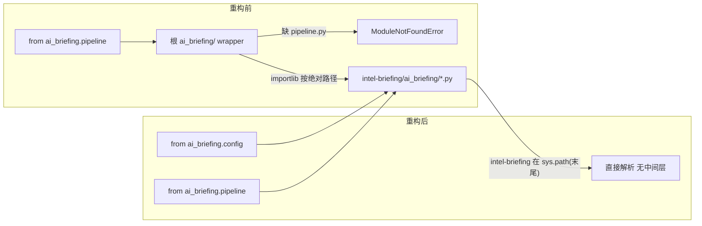
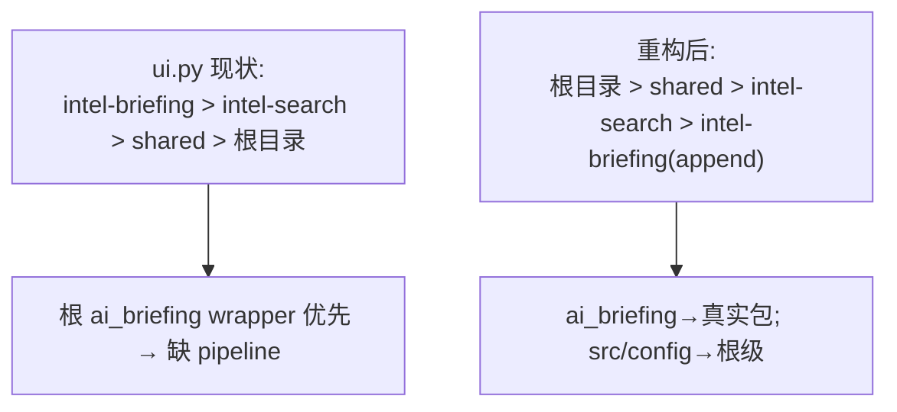

## 用户需求

确认执行此前已讨论并达成共识的重构方案：移除根目录 `ai_briefing/` 这一层冗余 thin-wrapper 兼容层，使 `ai_briefing` 包名直接映射到 `intel-briefing/ai_briefing/` 真实实现包，同时修正入口脚本的 `sys.path` 配置，确保导入解析正确、无包名冲突，且所有调用方的 import 语句保持原样不变。

## 产品/功能概述

本次为纯架构重构（无新增 UI / 功能），目标是消除因历史原因产生的"根 wrapper 包 + importlib 硬加载真实模块"的绕路设计。重构后：

- 调用方 `from ai_briefing.xxx import ...` 写法完全不变，但解析目标由根 wrapper 变为 `intel-briefing/ai_briefing/` 真实模块。
- 修复此前 `ai_briefing.pipeline` 缺失导致的 `ModuleNotFoundError`（连同上次紧急补的临时 `pipeline.py` wrapper 一并消除）。

## 核心要点

- 删除根 `ai_briefing/` 目录（含此前补的 untracked `pipeline.py` wrapper）。
- 修正 `main.py` 与 `ui.py` 的 `sys.path`，使 `ai_briefing` 经 `intel-briefing` 解析、根级 `src/`/`config.py` 保持优先。
- 同步更新 README 中涉及根 `ai_briefing/` 的目录树描述。

## 技术栈

- 语言：Python 3（既有项目，无新增依赖）
- 运行入口：`main.py`（CLI）、`ui.py`（Streamlit）
- 测试：pytest（根 `tests/` 与 `intel-briefing/tests/`）

## 实施策略

采用"删中间层 + 修 sys.path"的最小化重构：

1. 真实包 `intel-briefing/ai_briefing/__init__.py` 内部已使用 `from ai_briefing.config import ...` 绝对导入，本身即以顶层包 `ai_briefing` 身份工作；根 wrapper 用 `importlib` 按绝对路径重导出它，纯属冗余。删除根 `ai_briefing/` 后，只要 `intel-briefing` 在 `sys.path` 上，`from ai_briefing.xxx` 即解析到真实包。
2. `main.py` 当前只把 `shared` 加进 `sys.path`，删 wrapper 后将无法解析 `ai_briefing`。需在入口补 `sys.path.append(intel-briefing)`；同时显式保证根目录优先（避免 `intel-briefing/src/` 抢占根 `src/`），故先 `sys.path.insert(0, ROOT)`。
3. `ui.py` 当前用 `sys.path.insert(0, intel-briefing)` 把子项目置于根之前，存在 `intel-briefing/src/` 覆盖根 `src/`（缺 search/analysis）的风险；改为 `append` 即可消除该风险且仍保证 `ai_briefing` 可解析。

## 关键技术决策与权衡

- **为何用 append 而非 insert(0) 加入 intel-briefing**：`intel-briefing/` 下存在 `src/`、`config.py`，若插到根目录之前，`from src.xxx`/`from config` 会解析到子项目内的同名模块（功能不全），破坏搜索与配置。append 到末尾后，根级 `src`/`config` 自然优先，仅在根不存在 `ai_briefing` 时才回退到 `intel-briefing/ai_briefing/`。
- **为何保留调用方 import 语句不变**：真实包导出的公开符号（`run_briefing_pipeline`、`AIBriefingCollector` 等）与 wrapper 完全一致，且 `@patch("ai_briefing.pipeline.AIBriefingCollector")` 这类基于字符串的 mock 路径在模块名空间不变时依旧有效，故无需改动任何业务代码，回归成本最低。
- **config 无冲突**：`intel-briefing/config.py` 是根 `config.py` 的完整 re-export；改为 append 后 `from config import ...` 解析到根 `config.py`（变量齐全），行为等价。

## 实施注意事项（防回退）

- 仅改动 `sys.path` 设置与删除 wrapper，不触碰任何业务逻辑；调用方 `main.py`、`src/ui/briefing_runner.py`、测试文件的 import 语句保持不变。
- 删除根 `ai_briefing/` 会一并移除上次紧急补丁的 `pipeline.py`，该 bug 由此从根上消除，无需单独回退。
- 改动后必须跑导入自检 + `pytest`，确认根 `src` 解析未被影响（`search_pipeline` 等仍存在）。
- `ui.py` 当前能运行（仅 briefing 报错），说明根 `src/` 当前实际优先；将 intel-briefing 由 insert(0) 改为 append 只会增强该保证，不会引入回归。

## 架构设计

### 重构前后导入解析对比



### sys.path 顺序变化



## 目录结构（本次改动文件）

```
IntelNexus/
├── ai_briefing/                 # [DELETE] 根 wrapper 目录（9 个 re-export 文件），重构后整体移除
├── main.py                      # [MODIFY] 第 7-11 行 sys.path：补 ROOT 优先 + append intel-briefing
├── ui.py                        # [MODIFY] 第 14 行 insert(0, intel-briefing) → append(...)
├── README.md                    # [MODIFY] 第 44 行目录树中 ai_briefing/ 描述改为 intel-briefing/ai_briefing/
└── tests/
    └── conftest.py              # [NO CHANGE] 已正确将 intel-briefing 加入 sys.path
```

（注：`intel-briefing/ai_briefing/` 真实包、`src/`、`config.py`、各测试文件均无需改动。）

## 关键代码结构（sys.path 设置）

main.py（修改后顶部）:

```python
import os, sys
_ROOT = os.path.dirname(os.path.abspath(__file__))
if _ROOT not in sys.path:
    sys.path.insert(0, _ROOT)                      # 保证根级 src/config 优先
sys.path.insert(0, os.path.join(_ROOT, "shared"))
sys.path.append(os.path.join(_ROOT, "intel-briefing"))  # ai_briefing 解析到真实包
```

ui.py（修改后第 12-14 行）:

```python
sys.path.insert(0, os.path.join(_root, "shared"))
sys.path.insert(0, os.path.join(_root, "intel-search"))
sys.path.append(os.path.join(_root, "intel-briefing"))   # 末尾追加，避免覆盖根 src
```