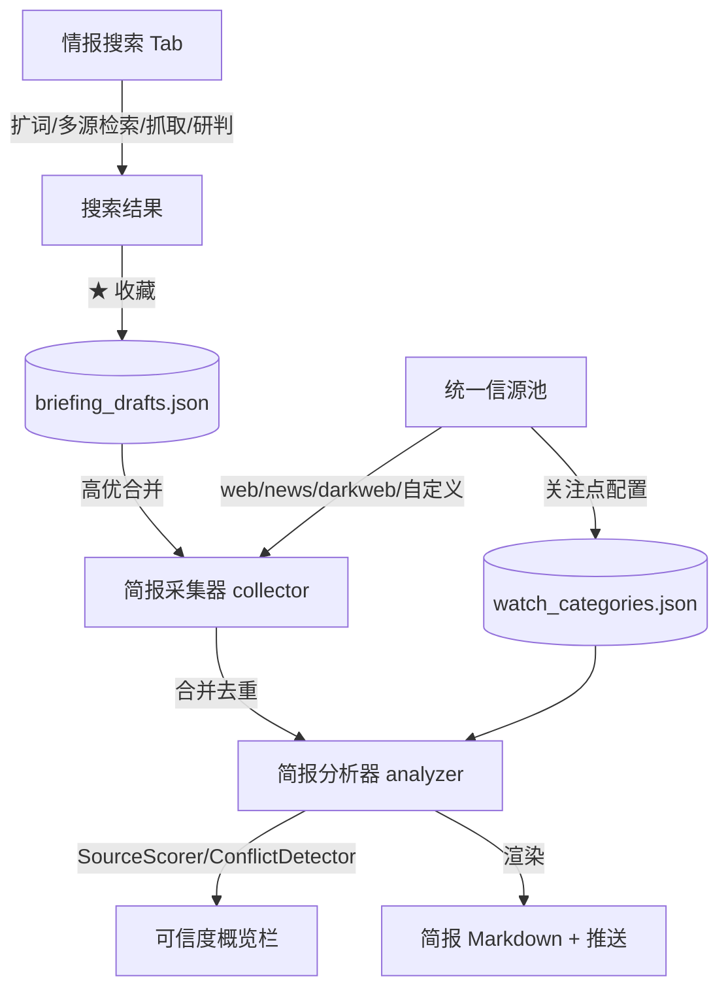

## 用户需求

用户确认了情报搜索与简报中心融合的方向，并明确三点约束：目标用户为 AI/网安态势研判人员；接受统一信源池方案；简报接入暗网在合规范围内（默认关闭、可开启）。

## 产品概述

将当前割裂的「情报搜索」与「简报中心」两个 Tab 打通为一条情报生产流水线：搜索负责按需深挖单点线索，简报负责定时自动汇总推送。两个模块共享同一套检索与 LLM 底层，本次改造让数据在用户心智层与数据流层真正流通。

## 核心特性

- 统一信源池：合并搜索内置注册表与简报 sources.json，用户仅维护一份「我的信源」，搜索与简报共用；简报采集器接入暗网注册表（遵循 ENABLE_DARKWEB 开关）
- 搜索结果收藏为简报素材：搜索结果每条增加收藏按钮，沉淀至 briefing_drafts.json，简报生成时作为高优输入拼入对应栏目
- 简报可信度概览：简报生成前复用现有 SourceScorer 与 ConflictDetector，在简报中增加可信度概览栏（平均可信度、冲突提示）
- 关注点可配置化：将写死的 WATCH_CATEGORIES 迁移至 data/watch_categories.json，简报 Tab 提供新增/编辑关注点 UI，默认保留原 6 类
- 顶层关系引导与闭环入口：在主标题下补充两模块关系说明，搜索 Tab 增加「生成简报草稿」入口，打通心智

## 技术栈选择

- 保持现有栈：Python + Streamlit 1.37.1（单页双 Tab）、JSON 文件持久化（safe_read_json/safe_write_json）、shared.search 注册表抽象、shared.llm 链路、现有 i18n 字典合并机制
- 不引入新依赖、新框架；新增数据文件与读写模块均复刻 `intel-briefing/src/config/sources.py` 的 thin-wrapper 模式

## 实现方案

采用「数据层打通 → 体验层闭环 → 配置层解耦」三阶段落地，复用现有 `SearchSourceRegistry`、`SourceScorer`、`ConflictDetector`、`get_all_sources/get_all_subscribers` 等已验证组件，避免重复造轮子。

**关键决策与权衡**

1. 统一信源：新增 `src/config/sources_registry.py`（或扩展现有 sources 模块），聚合「内置注册表源（web/news/darkweb）+ 用户自定义源（RSS/Web/Onion）」。简报 collector 改为从统一信源读取并调用 `SearchSourceRegistry` 全类别采集。暗网仅在 `ENABLE_DARKWEB` 为真时纳入，保持默认安全。
2. 收藏草稿：搜索结果面板每条渲染 `★` 按钮，写入 `data/briefing_drafts.json`（结构：{id, title, url, content, source, saved_at, category_hint}）。简报 analyzer 读取后与自动采集结果合并去重，按 category_hint 或关键词归栏。
3. 可信度概览：复用 `src/analysis/credibility.py` 的 `SourceScorer.evaluate` 与 `ConflictDetector.detect`，在 analyzer 生成前对合并结果评分，输出「可信度概览」栏（平均分数、高/低可信数、冲突条数），降级时无 LLM 也能展示基础统计。
4. 关注点配置化：`WATCH_CATEGORIES` 默认仍由代码提供，新增 `data/watch_categories.json` 覆盖/追加；新增 `src/config/watch_categories.py` 读写模块（thin-wrapper 风格），analyzer 与 UI 改从该函数读取。UI 提供「新增关注点」表单（名称、关键词、绑搜索源类别）。
5. 顶层引导：在 `ui.py` 标题下（`main-subtitle` 之后）增加一行关系说明；搜索 Tab 结果区增加「将当前结果存入简报草稿」批量按钮，形成搜→报闭环。

**性能与可靠性**

- 收藏写入为本地 JSON 追加，O(1)，无网络开销；简报生成时草稿合并走现有 `_deduplicate_results` 去重，避免重复。
- 可信度评分复用搜索已验证逻辑，新增开销为一次本地打分（无额外 LLM 调用），对定时任务影响可忽略。
- 暗网接入复用 `SearchSourceRegistry(darkweb_advanced=...)`，不新增爬虫；默认关闭，零风险。
- 所有新增 JSON 读写复用 `safe_read_json/safe_write_json` 保证并发安全。

## 实现要点

- 统一信源后，旧 `sources.json` 中 RSS/Web 源自动归类为「自定义源」，向后兼容，不破坏现有订阅者配置。
- 收藏按钮与草稿读取需处理 `session_state` 中搜索结果的字段名（title/url/content/source）与简报采集结果一致，确保 merger 无需转换。
- 关注点配置 UI 需复用简报 Tab 现有的 workbench 标签条风格（bf-panel--source 同类），不引入新视觉语言。
- 顶层引导文案通过 i18n 键注入，主项目 i18n 合并子项目键的机制已验证可用。

## 架构设计



- 数据流：搜索（Pull）与简报（Push）通过草稿 JSON 与统一信源池连接，形成飞轮。
- 控制流：UI Tab → runner/pipeline → collector/analyzer → 共享 registry/分析组件。

## 目录结构

```
intel-briefing/ai_briefing/
├── collector.py              # [MODIFY] 从统一信源读取；接入暗网注册表；合并收藏草稿为高优输入
├── analyzer.py               # [MODIFY] 生成前跑 SourceScorer+ConflictDetector；生成「可信度概览」栏；读可配置关注点
intel-briefing/ai_briefing/config.py  # [MODIFY] WATCH_CATEGORIES 改为从 data 文件读取，保留代码默认值
intel-briefing/src/config/
├── sources.py                # [MODIFY] 扩展为统一信源（含注册表源类别），保留现有 API
└── watch_categories.py       # [NEW] 关注点配置读写（thin-wrapper 风格，默认回退代码常量）
src/config/
├── sources.py                # [MODIFY] 转发至统一信源模块
├── watch_categories.py       # [NEW] 同 intel-briefing 版本的转发 wrapper
└── briefing_drafts.py        # [NEW] 收藏草稿读写（safe_write_json 追加/列表/删除）
src/ui/
├── search_pipeline.py        # [MODIFY] 结果每条加 ★ 收藏按钮；结果区加「存为简报草稿」批量入口
├── briefing_viewer.py        # [MODIFY] 关注点管理面板（新增/编辑 UI）；可信度概览渲染区
└── sidebar.py                # [MODIFY] 保持全局设置，确认无简报业务回归
ui.py                         # [MODIFY] 标题下加两模块关系引导说明
shared/ui/styles.py           # [MODIFY] 补充草稿收藏按钮与可信度概览栏样式（沿用 workbench 变量）
data/
├── briefing_drafts.json      # [NEW] 收藏草稿存储
└── watch_categories.json     # [NEW] 用户关注点覆盖配置（初始为空，回退默认）
src/ui/i18n.py / intel-briefing/src/ui/i18n.py  # [MODIFY] 补充引导/收藏/可信度/关注点相关 i18n 键
```

## 关键代码结构（节选）

```python
# src/config/briefing_drafts.py
def add_draft(item: dict) -> bool: ...
def get_drafts(limit: int = 50) -> list: ...
def remove_draft(draft_id: str) -> bool: ...
def clear_drafts() -> None: ...

# intel-briefing/src/config/watch_categories.py
def get_all_categories() -> dict: ...   # 合并 data/watch_categories.json 与代码默认
def add_category(cat_id: str, cfg: dict) -> bool: ...
def update_category(cat_id: str, cfg: dict) -> bool: ...
def remove_category(cat_id: str) -> bool: ...
```

## 设计风格

本次为 Streamlit 现有双 Tab 体验增强，不切换框架。视觉延续项目既有的「workbench 冷灰工业风」（情报搜索用 morandi 风、简报用 workbench 风），不引入 emoji、不新增欢迎页。所有新增元素（收藏按钮、可信度概览栏、关注点配置表单）复用既有 CSS 变量（--wb-text、--wb-border、--wb-card、--wb-tag-gen 等）与标签条（bf-panel / bf-label / status-dot）体系，保持冷灰工业质感与信息密度。

## 页面区块规划

- 顶层（ui.py 标题下）：一行关系引导条——「情报搜索：深挖单点线索 · 简报中心：自动汇总推送 · 搜到的线索可一键收入简报」，灰色副文本，无装饰。
- 情报搜索 Tab：结果卡片每条右上角增加细描边「★ 收藏」文字按钮；结果区底部增加「将当前结果存入简报草稿」整块按钮（use_container_width）。
- 简报中心 Tab：引导条下新增「关注点管理」面板（bf-panel--source 风格），提供新增/编辑表单与列表；生成结果输出区顶部新增「可信度概览」栏（bf-panel 风格，展示平均可信度、高/低可信数、冲突数，带 status-dot 状态点）。
- 交互：收藏按钮 hover 时边框微亮；可信度概览栏与现有 OUTPUT 区视觉一致，不跳脱。

## Agent Extensions

### SubAgent

- **code-explorer**
- Purpose: 在生成详细实现前，跨文件核实统一信源、收藏草稿、可信度复用、关注点配置化的精确修改点与调用链，避免破坏现有契约
- Expected outcome: 产出准确的文件级修改清单与接口契约核对，确保 plan 落地无回归