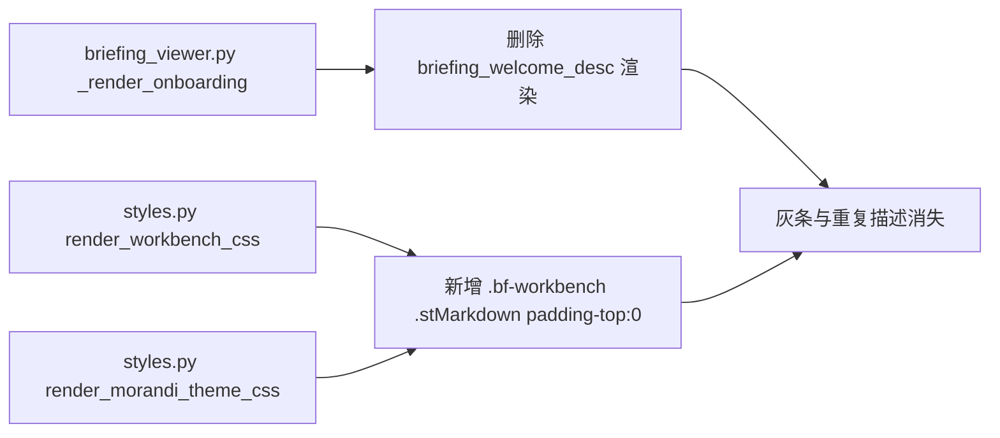

## 用户需求

用户反馈简报中心内「AI简报系统：定时采集、分析与推送 AI 与网络安全情报。」上方的灰色区域仍未去除，要求分析并修复。

## 产品概述

IntelNexus 简报中心（Streamlit）在上一轮已移除内部大标题并收紧顶部 padding，但引导条上方仍残留一条灰色横带，根因是 `_render_onboarding()` 中独立渲染的 `briefing_welcome_desc` 描述段落单独占用一个 Streamlit `.stMarkdown` 容器，其自带灰色背景与 padding 形成视觉灰条，且该描述与顶部 `module_guidance` 重复。

## 核心特性

- 删除简报中心引导区中重复的描述文案「AI简报系统：定时采集、分析与推送 AI 与网络安全情报。」整行渲染。
- 通过 CSS 收紧 `.bf-workbench` 内部 `.stMarkdown` 顶部内边距，消除容器首个组件的顶部灰边，确保灰带不再出现。
- 保持三步引导条（✓/→/数字 状态）、各功能面板与生成逻辑不变。

## 技术栈

- 语言：Python 3.10+（现有）
- Web UI：Streamlit（现有 `ui.py` / `briefing_viewer.py`）
- 样式：内联 CSS（`intelnexus/core/ui/styles.py`）
- 国际化：`intelnexus/ui/i18n.py` 与 `intelnexus/search_app/i18n.py`

## 实现方案

采用「删冗余文案 + 修容器灰边」策略，仅改 2 个文件，不动数据层与业务逻辑。

1. **删除重复描述**：`_render_onboarding()` 中第570行 `st.markdown(f'<p ...>{get_text("briefing_welcome_desc")}</p>', ...)` 单独占用一个 Streamlit 容器，产生灰条且与顶部 `module_guidance` 语义重复。直接删除该行渲染，页面顶部进入顺序变为：Tab → module_guidance → 三步引导条。

2. **CSS 收紧首个组件顶部灰边**：Streamlit 将每个 `st.markdown` 包成 `.stMarkdown` block，自带 `padding`。在 `.bf-workbench` 作用域内对 `.stMarkdown` 设置 `padding-top: 0 !important`，消除引导条上方的灰边残留。该规则需在 `render_workbench_css` 与 `render_morandi_theme_css` 两处都加，确保两种主题下一致。

性能与可靠性：均为静态删除与 CSS 类新增，无运行时开销；`briefing_welcome_desc` 词条保留在 i18n 表中不删除（避免潜在其他引用受影响）；向后兼容，不影响简报生成与推送逻辑。

## 实现注意事项

- 删除仅限 `_render_onboarding()` 内的描述 `<p>` 渲染行，不删 i18n 词条。
- CSS 修改需同时覆盖 styles.py 中两处 workbench 定义，确保双主题一致。
- 不动任何 `data/*.json`、不改订阅/数据源逻辑、不改 `get_text` 函数。

## 架构设计

纯展示层调整，无架构变更。修改链路：



## 目录结构

```
IntelNexus/
└── intelnexus/
    ├── ui/
    │   └── briefing_viewer.py   # [MODIFY] 删除 _render_onboarding 中 briefing_welcome_desc 的独立 <p> 渲染
    └── core/ui/
        └── styles.py            # [MODIFY] 在 render_workbench_css 与 render_morandi_theme_css 的 .bf-workbench 作用域内新增 .stMarkdown padding-top:0 规则
```

## 关键代码结构

无需新增接口或数据类；改动均为既有函数内的渲染删除与 CSS 规则新增。

## Agent Extensions

### Skill

- **frontend-design**
- Purpose: 为简报中心顶部灰边修复与去除冗余描述后的视觉层级提供专业设计指导，确保页面紧凑、无模板感。
- Expected outcome: 顶部直接进入 Tab → module_guidance → 三步引导条，灰色横带消失，视觉层级干净。