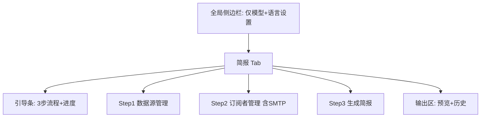

## 用户需求

调整简报中心（含相关侧边栏）的引导与操作顺序，使其更合适、便捷、清晰、全面。

## 产品概述

当前简报业务功能在全局侧边栏与简报 Tab 主面板中重复出现，且缺少操作引导和空状态提示。本次调整将简报业务全部收拢到简报 Tab，按「数据源 → 订阅者 → 生成简报」三步引导流程重排，并补全引导文案与空状态提示，侧边栏仅保留全局模型设置。

## 核心功能

- 侧边栏瘦身：移除数据源管理、订阅管理、生成简报、查看历史等简报业务模块，仅保留 AI 模型与语言设置。
- 简报 Tab 顶部引导条：以不占空间的 3 步流程（数据源 / 订阅者 / 生成）展示操作主线，并按当前配置进度标注完成状态。
- 3 步顺序重排：数据源管理 → 订阅者管理（含 SMTP 邮件设置）→ 生成简报（类目多选 + 推送开关 + 按钮 + 统计）→ 输出区（预览 + 历史）。
- 空状态下一步引导：无数据源 / 无订阅者时给出明确行动提示，替代干巴巴的占位文案。
- 订阅详情精简：将整条 JSON dump 改为仅渲染关键字段（渠道 / 推送周期 / 关注类目）。
- 补全预留引导文案：填充 i18n 中 8 个留空键（中英双语）。

## 技术栈

- 框架：Streamlit 1.37.1（Python）
- 样式：现有 workbench 冷灰工业风（CSS 由 `shared/ui/styles.render_workbench_css` 注入，保持不引入 emoji / 欢迎页）
- 国际化：`src/ui/i18n.py` / `intel-briefing/src/ui/i18n.py` 字典驱动
- 状态：`st.session_state`（用于判断是否已配置数据源 / 订阅者，驱动引导条进度）

## 实现方案

**策略**：通过删除重复、重排顺序、补充引导三层手段，把"功能散落、无引导"的体验收敛为"单一入口 + 明确流程 + 空状态提示"。

**关键决策与理由**：

1. 侧边栏移除简报业务（仅留设置）——侧边栏为全局，同时服务搜索与简报两个 Tab；当前在搜索 Tab 下展示简报管理造成认知混乱。移除后侧边栏聚焦、两个 Tab 职责清晰。
2. 引导条用普通 `st.markdown` + 内联状态点渲染（非 expander、非组件库），契合项目 workbench 风格且避免 1.37.1 的 expander 嵌套限制。进度判断复用已有的 `get_all_sources()` / `get_all_subscribers()` 返回结果（panel 内已调用，无额外开销）。
3. 文案走 i18n 字典，新增内容填进已预留但为空的键，避免新增 key 导致其他语言缺译；中英双语同步。
4. `view_details` 由 `st.json(sub)` 改为 `st.markdown` 渲染关键字段，规避之前踩过的 expander 嵌套坑，并降低信息噪音。

**性能与可靠性**：

- 引导条进度依赖 `get_all_sources()` / `get_all_subscribers()`，这两个调用在各 panel 内本就执行，引导条直接复用 session 内已有返回值或轻量再调用一次（数据源/订阅者数量通常极小，O(n) 无瓶颈）。
- 不引入新依赖、不新增网络/IO；所有改动为纯 UI 渲染层。
- 保留既有 `st.rerun()` 数据刷新逻辑，避免破坏增删改后状态同步。

**避免技术债**：复用现有 `render_data_sources_panel` / `render_subscriptions_panel` / `render_generate_panel` 三个函数，仅在其内部或 `render_briefing_center` 编排层做补充，不重写业务逻辑；主项目 `src/ui/` 与子项目 `intel-briefing/src/ui/` 保持同步，避免双份代码继续漂移。

## 实现备注

- 保持 `Streamlit 1.37.1` 约束：普通 `st.expander()` 可用但**不可嵌套**；引导条与详情区一律用 `st.markdown` / `st.container()`，不嵌套 expander。
- `ui.py` 中 `render_sidebar()` 现在返回 `model`，需保留返回值契约（`search_mode, model, threads = render_sidebar()`），瘦身后的侧边栏仍返回 `(search_mode, model, threads)` 三元组（search_mode/threads 维持原默认或空值，仅 model 来自设置面板）。
- 日志沿用 `shared.logger.get_logger`，不在 UI 层新增日志噪音。
- 改动仅限简报相关 UI，不触及搜索 Tab、pipeline、配置存取逻辑，控制爆炸半径。

## 架构设计



## 目录结构

```
src/ui/
├── sidebar.py            # [MODIFY] 移除 _render_data_sources / _render_subscriptions / _render_briefing_actions 中的简报业务渲染，仅保留 _render_model_settings，render_sidebar 仍返回 (search_mode, model, threads)
└── briefing_viewer.py    # [MODIFY] render_briefing_center 顶部新增引导条；render_data_sources_panel / render_subscriptions_panel 补充空状态下一步引导；view_details 改为 st.markdown 关键字段；保持 Sources→Subscribers→Generate→输出 顺序

intel-briefing/src/ui/
├── sidebar.py            # [MODIFY] 同 src/ui/sidebar.py 同步瘦身
├── briefing_viewer.py    # [MODIFY] 同 src/ui/briefing_viewer.py 同步主面板改动
└── i18n.py               # [MODIFY] 填充 briefing_welcome_desc / welcome_step_sources(_desc) / welcome_step_subscribers(_desc) / welcome_step_generate(_desc) / briefing_quick_tip / quick_actions 共中英文各 8 键
```

## 关键代码结构

引导条进度判断（在 `render_briefing_center` 内）：

```python
def _render_onboarding():
    sources = get_all_sources()
    subs = get_all_subscribers()
    step1_done = bool(sources.get("subscription_sources") or sources.get("custom_sources"))
    step2_done = bool(subs)
    # 用 st.markdown 渲染 3 步 + 状态点（✓/○），不嵌套 expander
```

## Agent Extensions

### SubAgent

- **code-explorer**
- 目的：在生成最终改动前，交叉核对 `src/ui/` 与 `intel-briefing/src/ui/` 两处 sidebar / briefing_viewer 的函数签名、返回值契约，确保瘦身改动不破坏 `ui.py` 的 `render_sidebar()` 调用约定。
- 预期结果：确认两处文件待改函数的精确行号与返回结构，避免漏改或破坏 imports。