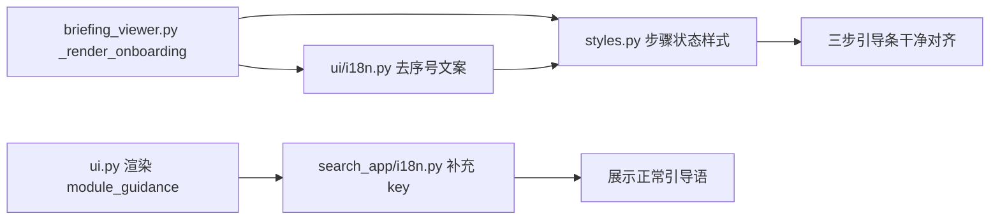

## 用户需求

优化「简报中心」界面的排版与内容展示，修复截图暴露出的显示缺陷。

## 产品概述

IntelNexus 是 Streamlit 构建的多源情报分析平台，顶部 Tab 切换「情报搜索」与「简报中心」。当前「简报中心」存在未翻译占位符、引导步骤序号双重错位、样式变量失效等问题，需要打磨为干净、层级清晰的工业风工作面板。

## 核心特性

- 修复顶部 `module_guidance` 占位符，显示正常的中/英文界面引导语，不再泄露 key 名。
- 修复三步引导条的双重+错位序号，统一为「1. 配置数据源 / 2. 管理订阅 / 3. 生成简报」的单序号顺序。
- 优化引导步骤视觉状态：已完成步骤显示 ✓ + 绿色，当前待办步骤显示 → + 蓝色，未完成显示灰色序号，状态一目了然。
- 修复 CSS 中 `.bf-step__head` 引用未定义变量 `var(--wb-text)` 导致的颜色失效，并补强步骤卡片状态样式与对齐。

## 技术栈

- 语言：Python 3.10+（现有）
- Web UI：Streamlit（现有 ui.py）
- 样式：内联 CSS（intelnexus/core/ui/styles.py 中 render_workbench_css）
- 国际化：intelnexus/ui/i18n.py 与 intelnexus/search_app/i18n.py 合并词条表

## 实现方案

采用「最小改动 + 就地修复」策略，只修改导致显示缺陷的 4 个文件，不触碰数据层与业务逻辑。核心决策如下：

1. **i18n 文案去序号**：`_render_onboarding()` 已在 `briefing_viewer.py` 用 `f'{i+1}.'` 自动生成序号，因此把 `intelnexus/ui/i18n.py` 里三处 `welcome_step_*` 文案的写死序号（`2.`/`3.`/`1.`）去掉，保留纯标题。避免双重序号，同时让序号顺序与代码步骤数组顺序（sources→subscribers→generate）一致。
2. **补充 module_guidance**：在 `intelnexus/search_app/i18n.py` 的 zh/en 两张表中新增该 key，给出 Tab 切换引导语。`get_text()` 回退逻辑会优先命中 search 表，因此放此处即可被全站复用。
3. **引导状态可视化**：在 `_render_onboarding()` 内根据 `done` 标记生成 `bf-step--done`/`bf-step--current`/`bf-step--pending` 类名，配合前缀图标（✓ / → / 空）表达进度。步骤顺序固定为：配置数据源（基于是否已有源）、管理订阅（基于是否已有订阅者）、生成简报（恒为未完成/当前动作）。
4. **CSS 修复与增强**：把 `.bf-step__head` 的 `var(--wb-text)` 改为已定义的 `var(--wb-text-primary)`；为三种状态添加边框/背景/图标颜色区分；微调 `.bf-step` 内边距与 `min-height` 保证三栏等高对齐。

性能与可靠性：均为静态文案与 CSS 类切换，无新增运行时开销；改动局限在 4 个文件，向后兼容，不影响简报生成与推送逻辑。

## 实现注意事项

- 保持面板渲染顺序不变（关注点管理→数据源→订阅→生成），仅打磨引导条与样式。
- i18n 修改需同步 zh 与 en 两张表，避免英文模式出现同样问题。
- CSS 修改需同时覆盖 styles.py 中两处 workbench 定义（`render_workbench_css` 与 `render_morandi_theme_css` 中的 `.bf-step` 相关片段），确保两种主题下表现一致。
- 不改任何 `data/*.json` 字段与业务逻辑函数。

## 架构设计

本任务为纯展示层修复，不涉及架构变更。修改链路如下：



## 目录结构

```
IntelNexus/
├── intelnexus/
│   ├── ui/
│   │   ├── i18n.py              # [MODIFY] 去除 welcome_step_sources/subscribers/generate 文案中的写死序号
│   │   └── briefing_viewer.py   # [MODIFY] _render_onboarding 按步骤顺序输出，附加 done/current/pending 状态类与图标
│   ├── search_app/
│   │   └── i18n.py              # [MODIFY] zh/en 两表新增 module_guidance 引导语
│   └── core/ui/
│       └── styles.py            # [MODIFY] 修复 .bf-step__head 变量；新增 .bf-step--done/--current/--pending 样式；微调内边距与最小高度
```

## 关键代码结构

无需新增接口或数据类；改动均为既有函数内的字符串与 CSS 类调整。

## Agent Extensions

### Skill

- **frontend-design**
- Purpose: 在打磨简报中心引导条与步骤卡片视觉时，提供排版、色彩与状态层级的工业化设计指导，避免默认模板感。
- Expected outcome: 三步引导条与状态样式具备清晰的视觉层级、一致的对齐与专业的冷灰工业风观感。