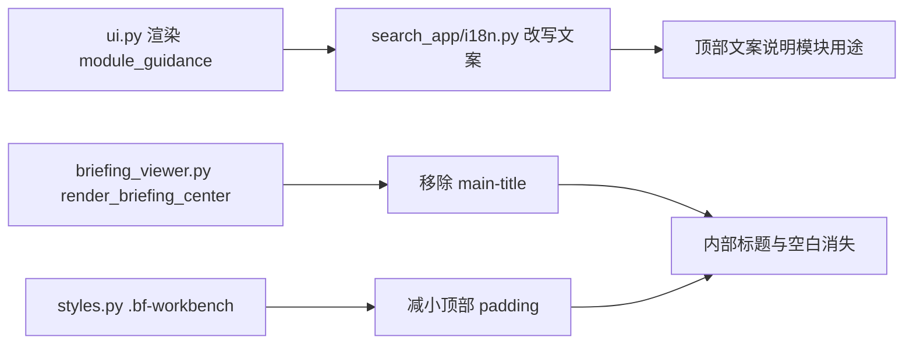

## 产品概述

在上一轮简报中心排版优化的基础上，进一步处理顶部引导文案不清、内部标题重复、顶部空白过多三个视觉问题，使「简报中心」Tab 的信息层级更直接、更紧凑。

## 核心特性

- 将顶部 `module_guidance` 从「教用户切换 Tab」改为「说明当前模块用途」。
- 移除简报中心内部重复的「简报中心」大字标题。
- 收紧 `.bf-workbench` 顶部 padding，减少 Tab 与内容之间的灰色空白。
- 保留三步引导条作为工作流入口，维持已完成/当前/待办状态视觉。

## Tech Stack

- 语言：Python 3.10+（现有）
- Web UI：Streamlit（现有 `ui.py` / `briefing_viewer.py`）
- 样式：内联 CSS（`intelnexus/core/ui/styles.py`）
- 国际化：`intelnexus/search_app/i18n.py` 与 `intelnexus/ui/i18n.py`

## Implementation Approach

采用「最小改动 + 聚焦信息层级」策略，只调整 3 个文件，不动数据层与业务逻辑。

1. **文案改写**：`module_guidance` 当前为「切换上方标签，在情报搜索与简报中心之间跳转」，偏向操作教程，与用户直觉不符。改为行动导向的模块说明，直接告诉用户「简报中心能做什么」。
2. **移除重复标题**：简报中心 Tab 已经显示「简报中心」，内部再渲染一个 28px 大标题属于冗余。去掉 `render_briefing_center()` 中的 `<div class="main-title">`。
3. **收紧顶部空白**：大标题去掉后，`.bf-workbench` 顶部 `16px` padding 会让引导条上方仍显空。适当减小顶部 padding，让引导条更贴近 Tab，强化工作面连贯性。

## Implementation Notes

- 文案同步更新 zh/en 两表，避免英文模式回退到旧文案。
- 移除 `main-title` 后，`.bf-workbench .main-title` 的 CSS 规则保留无妨；若项目其他位置复用了该规则也不会受影响。
- padding 调整建议从 `16px 20px` 改为 `8px 20px`（只减顶部），保留左右内边距保证内容不贴边。
- 不改任何 `data/*.json`、不改订阅/数据源逻辑。

## Architecture Design

纯展示层调整，无架构变更。



## Directory Structure

```
IntelNexus/
├── intelnexus/
│   ├── search_app/
│   │   └── i18n.py              # [MODIFY] 改写 module_guidance 中英文
│   ├── ui/
│   │   └── briefing_viewer.py   # [MODIFY] 移除 render_briefing_center 中的 main-title 渲染
│   └── core/ui/
│       └── styles.py            # [MODIFY] 收紧 .bf-workbench 顶部 padding
```

## 视觉方向

延续现有「冷灰工业风」工作面板基调，不做风格颠覆，只压缩信息层级、强化工作流入口。

1. **顶部引导文案**：从「操作教程」改为「模块定位说明」，让用户一进入 Tab 就知道这里是「配置数据源 → 管理订阅 → 生成/推送简报」的工作区。
2. **去掉内部大标题**：Tab 本身已标识当前模块，内部再重复一次会稀释视觉重心。移除后，三步引导条自然成为页面视觉起点，工作流感更强。
3. **压缩顶部空白**：减小 `.bf-workbench` 顶部 padding，让引导条更贴近 Tab，消除「顶部一大块灰色不知道干什么」的感觉，整体更紧凑。
4. **保留状态可视化**：三步引导条的 ✓ / → / 数字 状态色带继续承担进度提示，无需额外装饰。

## Agent Extensions

### Skill

- **frontend-design**
- Purpose: 为顶部引导文案改写与简报中心标题/空白区域的视觉压缩提供专业设计指导。
- Expected outcome: 引导文案自然直觉、标题层级清晰、页面留白合理，不出现模板感。