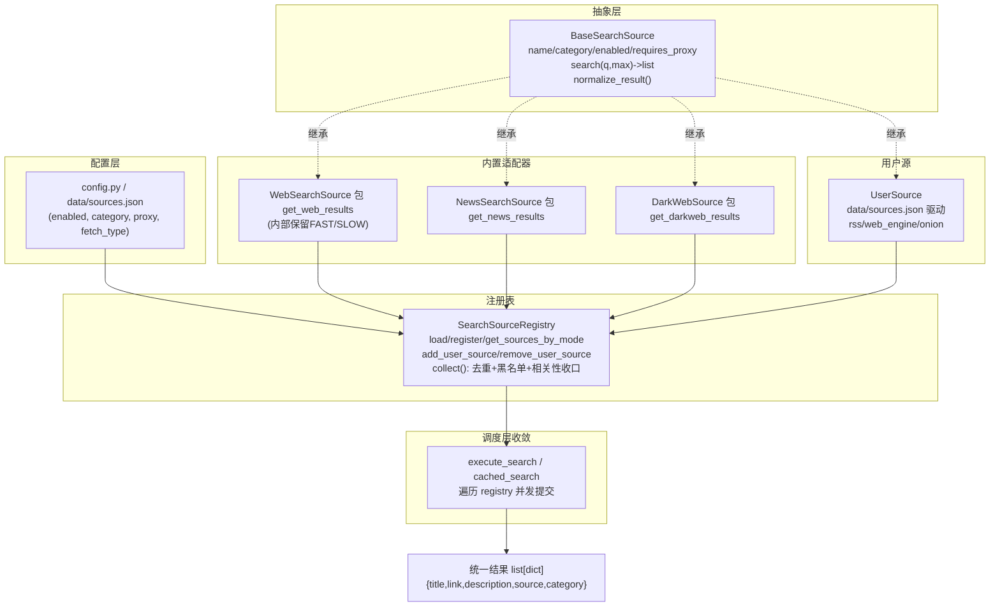

## 用户需求

将 IntelNexus 的搜索源（网页引擎、新闻源、暗网源、用户自定义源）重构为统一的 SearchSource 抽象体系，使"搜索源"成为一等公民，新增/禁用/配置源不再需要改动调度逻辑。

## 产品概述

建立统一的搜索源基类与注册表，将现有分散在 `shared/search/web.py`、`shared/search/news.py`、`intel-search/src/search/darkweb.py` 的成熟实现通过薄适配器接入统一接口；把暗网专属的自定义站点机制推广为通用"用户源"，并复用 `intel-briefing` 已有的 `sources.py` 持久化与增删能力。调度层删除按 mode 硬编码的 if 分支，改为遍历 registry。

## 核心特性

- 统一抽象基类 `BaseSearchSource`：`name / category / enabled / requires_proxy` 属性 + `search()` 抽象方法 + `normalize_result()` 结果归一化
- 三个内置适配器（Web / News / DarkWeb）薄包现有 `get_*_results`，不改动成熟实现
- 通用用户源 `UserSource`：由 `data/sources.json` 驱动，支持 rss / web_engine / onion 三种抓取方式，沿用代理收口
- `SearchSourceRegistry` 注册表：按 mode 查询启用源、运行时增删用户源、出口统一去重 + 域名黑名单 + 相关性过滤（收口一次）
- 模式常量集中到 `shared/search/modes.py`，消除 main.py / helpers.py / core.py 三处重复
- 调度层（`main.py` `execute_search` 与 `src/ui/search_pipeline.py` `cached_search`）改为遍历 registry
- CLI `--mode` 取值（web/news/darkweb/all）保持向后兼容

## 技术栈

- 语言：Python 3.12（与现有项目一致）
- 复用：现有 `shared/search/web.py`、`shared/search/news.py`、`intel-search/src/search/darkweb.py` 实现；`shared/search/__init__.py` 的 `get_http_proxies_for` / `is_blocked_domain` / `relevance_passes`；`intel-briefing/src/config/sources.py` 的持久化与增删 API
- 测试：pytest（复用 `tests/test_darkweb.py`、`tests/test_news_rss_retry.py` 的 mock 风格）

## 实现方案

采用"适配器 + 注册表"模式，将既有函数式搜索源封装为对象，调度层依赖注册表而非硬编码。核心决策：

1. **不动成熟实现**：`get_web_results` / `get_news_results` / `get_darkweb_results` 仅被适配器调用，零改动，规避回归风险。
2. **后处理收口一次**：现有各源内部各自调 `relevance_passes` / `is_blocked_domain`，重构后在 `registry.collect()` 出口统一调用，避免重复且便于维护；但 `NewsSearch.search_rss` 内针对按查询检索源的"相关性过滤"保留（其为源内行为，避免改变结果集语义）。
3. **代理收口沿用**：`UserSource` 与 `WebSearchSource` 必须调用 `get_http_proxies_for(requires_proxy)`，避免"幽灵代理"超时（见 `shared/search/__init__.py:79`）。
4. **FAST/SLOW 策略保留在 WebSearchSource 内部**："快速引擎结果不足再触发慢速引擎"逻辑封装进适配器 `search()`，registry 不感知，保持原有性能特征。
5. **复用 intel-briefing 数据源持久化**：`UserSource` 直接读写 `intel-briefing/src/config/sources.py` 管理的 `data/sources.json`（`custom_sources` 段），并新增 `fetch_type` 字段区分 rss/web_engine/onion，避免重复造轮子。

## 实现要点

- **性能**：registry 出口统一去重使用 `set` 做 O(n)，相关性/黑名单为 O(n×m)（m 为 token 数），与原各源内部重复调用相比整体下降。并发仍由调度层 `ThreadPoolExecutor` 负责，registry 仅提供源列表。
- **向后兼容**：`get_sources_by_mode(mode)` 对 `all` 返回全部启用源，`web/news/darkweb` 按 category 过滤；CLI 选项值不变。
- **日志**：复用 `shared.logger.get_logger`，错误按源粒度 `logger.warning` 并记录源名，避免吞掉异常。

## 架构设计



## 目录结构

```
shared/search/
├── source.py          # [NEW] BaseSearchSource 抽象基类：属性与 search 抽象方法、normalize_result 归一化
├── modes.py           # [NEW] SEARCH_MODES / MODE_DESCRIPTIONS 集中定义（消除三处重复）
├── registry.py        # [NEW] SearchSourceRegistry：注册/查询/增删用户源/collect 出口后处理收口
├── sources/           # [NEW] 适配器包
│   ├── __init__.py
│   ├── web_source.py    # [NEW] WebSearchSource 薄包 get_web_results，内部保留 FAST/SLOW
│   ├── news_source.py   # [NEW] NewsSearchSource 薄包 get_news_results
│   ├── darkweb_source.py# [NEW] DarkWebSource 薄包 get_darkweb_results（从 src/search/darkweb 导入）
│   └── user_source.py   # [NEW] UserSource：读 data/sources.json custom_sources，rss/web_engine/onion 三方式
├── __init__.py        # [MODIFY] 导出 registry / modes / sources，保留现有后处理函数
config.py              # [MODIFY] 新增 SOURCE_ENABLED 等开关（可选，优先级低于 sources.json）
main.py                # [MODIFY] execute_search 改为遍历 registry.get_sources_by_mode(mode)
src/ui/search_pipeline.py # [MODIFY] cached_search 改为遍历 registry，移除三段 if 与 custom_onion_sites 特殊处理
src/search/darkweb.py  # [MODIFY] 保留薄包，确认导出 get_darkweb_results / is_available 供 DarkWebSource 使用
intel-briefing/src/config/sources.py # [MODIFY] add_source 支持 fetch_type 字段；get_all_sources 返回含 fetch_type
tests/
├── test_source_base.py     # [NEW] 基类 normalize_result 与抽象契约测试
├── test_registry.py        # [NEW] 注册/按 mode 查询/collect 后处理收口/用户源增删测试
├── test_sources_adapters.py# [NEW] 三个内置适配器薄包测试（mock 底层 get_*_results）
└── test_user_source.py     # [NEW] UserSource rss/web_engine/onion 与代理收口测试
```

## 关键代码结构

```python
# shared/search/source.py
from abc import ABC, abstractmethod
from typing import List, Dict

class BaseSearchSource(ABC):
    name: str
    category: str          # "web" | "news" | "darkweb" | "custom"
    enabled: bool = True
    requires_proxy: bool = False

    @abstractmethod
    def search(self, query, max_results: int = 20) -> List[Dict]:
        ...

    def normalize_result(self, item: Dict) -> Dict:
        # 统一为 {title, link, description, source, category}
        ...
```