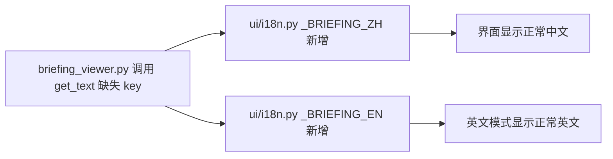

## 用户需求

修复简报中心订阅面板中泄露的 i18n key 名：数据源面板与订阅者面板引用的 `no_sources`、`no_subscribers`、`push_channels`、`schedule_settings`、`watch_categories` 五个词条在 `intelnexus/ui/i18n.py` 中未定义，导致界面直接显示 key 而非正常文案。

## 产品概述

IntelNexus 的简报中心（Briefing Center）使用 Streamlit 渲染，文案通过 `get_text()` 从中/英双语词条表读取。本轮仅需补齐缺失词条，使相关面板在无数据提示与表单分组标题处显示正常语言，消除 key 名泄露。

## 核心特性

- 在简报中心中文词条表新增 `no_sources`、`no_subscribers`、`push_channels`、`schedule_settings`、`watch_categories` 五个词条。
- 在英文词条表同步新增对应英文词条。
- 数据源面板无源时、订阅者面板无订阅者时及表单三个分组标题（推送渠道 / 推送设置 / 关注点）均显示正常文案，不再泄露 key。
- 仅新增词条，不改动任何业务逻辑、样式或函数签名。

## 技术栈

- 语言：Python 3.10+（现有）
- 国际化：单包 `intelnexus/ui/i18n.py` 内联 `_BRIEFING_ZH` / `_BRIEFING_EN` 两张表，`get_text()` 统一读取

## 实现方案

采用「最小改动 + 就地补表」策略，仅向 `intelnexus/ui/i18n.py` 的两张词条表各新增 5 个 key，不触碰任何渲染逻辑与 CSS。

关键决策与依据：

1. **词条归属 briefing 表而非 search 表**：`get_text()` 回退顺序为先 search 表、后 briefing 表。缺失 key 出现在简报中心面板，且语义属于简报中心（数据源/订阅/关注点），放入 `_BRIEFING_ZH/_BRIEFING_EN` 语义内聚、与现有 `data_source_management`、`subscription_management`、`watch_categories_mgmt` 等词条同表，便于维护。
2. **中英文同步新增**：避免英文模式下出现同样的 key 泄露；严格按照现有两表结构新增，保持键名一致。
3. **放置位置分组**：将 `no_sources` 紧邻 `data_source_management` 相关词条；`no_subscribers`、`push_channels`、`schedule_settings` 紧邻 `subscription_management`；`watch_categories` 紧邻 `watch_categories_mgmt`，维持语义邻近。

性能与可靠性：纯静态字典新增，无运行时开销；`get_text()` 回退逻辑天然兼容，向后安全；不触发任何 rerun 或数据层变更。

## 实现注意事项

- 新增 key 必须与 `briefing_viewer.py` 中 `get_text(...)` 调用使用的字符串完全一致（含下划线）。
- zh 与 en 两张表都要加，且键名一致。
- 词条值参考现有表述风格：数据源/订阅相关用「暂无…」、「推送渠道」/「推送设置」/「关注点」；英文保持首字母大写、与现有 `Subscription Management` 等风格一致。
- 不改 `data/*.json`、不改 `search_app/i18n.py`、不引入新函数。

## 架构设计

本任务为纯词条补齐，不涉及架构变更。修改链路：



## 目录结构

```
IntelNexus/
└── intelnexus/
    └── ui/
        └── i18n.py   # [MODIFY] 在 _BRIEFING_ZH 与 _BRIEFING_EN 两张表中新增 no_sources / no_subscribers / push_channels / schedule_settings / watch_categories 五个中英文词条
```

## 关键代码结构

无需新增接口或数据类；均为既有字典内的键值对新增。