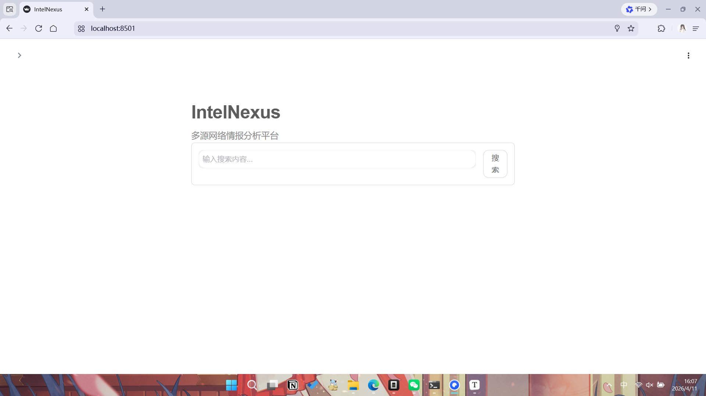

# IntelNexus 截图位置说明

请将以下截图按编号放入 `docs/images` 文件夹，并在文档中对应的位置添加图片链接。

---

## 截图位置说明（15+张）

### 1. 项目首页/启动界面
- **图1**: 项目启动画面 - 打开 http://localhost:8501 后的主界面截图
- **位置**: 文档开头，项目概述部分

### 2. 侧边栏设置
- **图2**: 侧边栏搜索模式选择截图
- **位置**: 搜索模式选择区域（全部来源/网页搜索/新闻资讯/暗网搜索）

### 3. 搜索输入区域
- **图3**: 主搜索输入框和搜索按钮截图
- **位置**: 搜索框区域

### 4. Model模型选择
- **图4**: LLM模型选择下拉菜单截图
- **位置**: 设置区域 - AI模型选择

### 5. 线程数设置
- **图5**: 线程数滑块设置截图
- **位置**: 高级设置 - 线程数

### 6. 暗网设置
- **图6**: 暗网搜索Tor设置界面截图
- **位置**: 暗网模式下的Tor设置

### 7. Tor状态检测
- **图7**: Tor运行状态检测结果截图
- **位置**: Tor状态显示区域

### 8. 搜索执行中
- **图8**: 搜索进行中的加载状态截图
- **位置**: 点击搜索后的等待界面

### 9. 搜索结果统计
- **图9**: 搜索结果数量和来源统计截图
- **位置**: 搜索完成后的统计区域

### 10. 报告生成中
- **图10**: 报告生成中的流式输出截图
- **位置**: 报告生成过程

### 11. 最终报告
- **图11**: 生成的完整情报报告截图
- **位置**: 报告展示区域

### 12. 下载按钮
- **图12**: 报告下载选项和按钮截图
- **位置**: 下载区域

### 13. 搜索结果详情
- **图13**: 搜索结果列表详情截图
- **位置**: 搜索结果展开区域

### 14. 分页导航
- **图14**: 搜索结果分页导航截图
- **位置**: 分页控件区域

### 15. 多语言切换
- **图15**: 中英文切换功能截图
- **位置**: 语言切换按钮

### 额外截图（可选）
- **图16**: 下载的Markdown报告文件截图
- **图17**: 下载的Word/PDF报告文件截图  
- **图18**: 命令行模式运行截图

---

## 图片命名建议

```
01_homepage.png        - 项目首页
02_sidebar.png       - 侧边栏
03_search_input.png  - 搜索输入
04_model_select.png   - 模型选择
05_threads.png      - 线程设置
06_darkweb.png      - 暗网设置
07_tor_status.png   - Tor状态
08_searching.png    - 搜索中
09_results.png      - 结果统计
10_generating.png  - 生成报告
11_report.png       - 最终报告
12_download.png     - 下载区域
13_details.png      - 结果详情
14_pagination.png  - 分页
15_language.png    - 语言切换
```

---

## 使用方法

在Markdown文档中添加图片：

```markdown

```

请将截图放入 `docs/images/` 文件夹后，按上述编号命名。